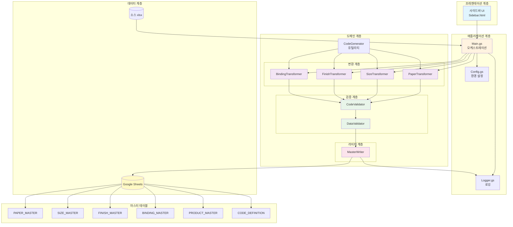
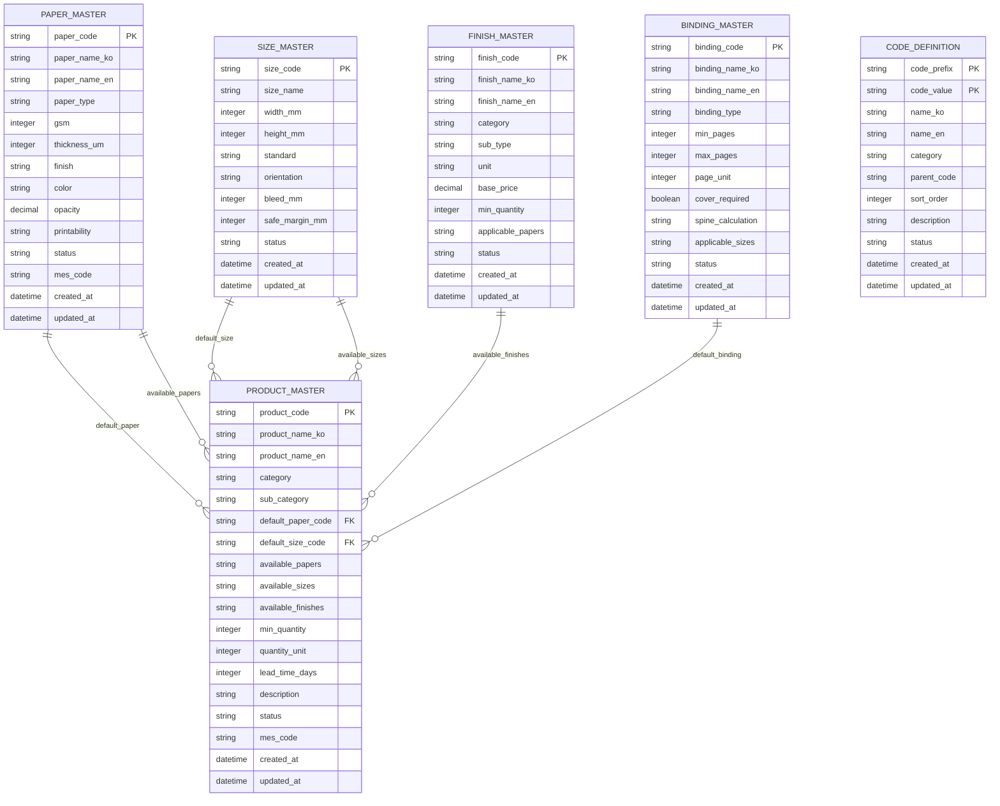
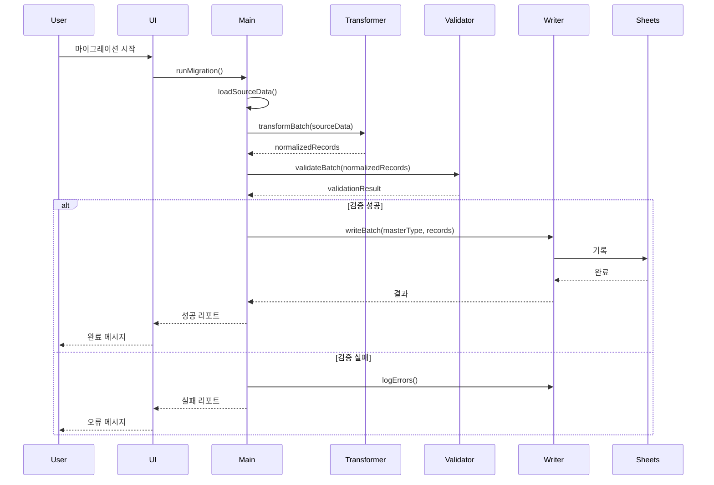

# System Architecture

본 문서는 후니프린팅 데이터 정규화 도구의 전체 시스템 아키텍처를 설명합니다.

## 목차

- [개요](#개요)
- [시스템 아키텍처](#시스템-아키텍처)
- [데이터 모델](#데이터-모델)
- [컴포넌트 상세](#컴포넌트-상세)
- [통합 패턴](#통합-패턴)

---

## 개요

### 아키텍처 원칙

1. **관심사 분리**: 변환, 검증, 기록 계층 분리
2. **단일 책임**: 각 클래스는 하나의 명확한 책임만 담당
3. **개방-폐쇄 원칙**: 확장에는 열려 있고, 수정에는 닫혀 있음
4. **종속성 역전**: 상위 모듈은 하위 모듈에 의존하지 않음

### 기술 스택

- **플랫폼**: Google Apps Script
- **데이터 소스**: Google Sheets (xlsx)
- **프로그래밍 언어**: JavaScript (ES5+)
- **스토리지**: Google Sheets
- **로깅**: Google Apps Script Logger + MIGRATION_LOG 시트

---

## 시스템 아키텍처

### 전체 아키텍처 다이어그램



### 계층별 역할

#### 1. 프레젠테이션 계층

**구성 요소**:
- `Sidebar.html`: 사용자 인터페이스

**역할**:
- 사용자 입력 수집
- 마이그레이션 실행 요청
- 진행 상황 표시
- 로그 표시

#### 2. 애플리케이션 계층

**구성 요소**:
- `Main.gs`: 메인 오케스트레이터
- `Config.gs`: 환경 설정
- `Logger.gs`: 로깅 시스템

**역할**:
- 워크플로우 조정
- 환경 설정 관리
- 로그 집계 및 저장

#### 3. 도메인 계층

**변환 계층**:
- `PaperTransformer`: 용지 데이터 변환
- `SizeTransformer`: 사이즈 데이터 변환
- `FinishTransformer`: 후가공 데이터 변환
- `BindingTransformer`: 제본 데이터 변환

**검증 계층**:
- `CodeValidator`: 코드 형식 및 무결성 검증
- `DataValidator`: 데이터 무결성 검증

**라이터 계층**:
- `MasterWriter`: 마스터 테이블 기록

**유틸리티**:
- `CodeGenerator`: 코드 생성 유틸리티

#### 4. 데이터 계층

**구성 요소**:
- 소스 xlsx 파일
- Google Sheets
- 마스터 테이블

**역할**:
- 데이터 저장소
- 데이터 접근 제공

---

## 데이터 모델

### ER 다이어그램



### 마스터 테이블 관계

#### 1:1 관계
- 없음 (모든 관계는 1:N 또는 M:N)

#### 1:N 관계
- `PAPER_MASTER` → `PRODUCT_MASTER` (기본 용지)
- `SIZE_MASTER` → `PRODUCT_MASTER` (기본 사이즈)
- `FINISH_MASTER` → `PRODUCT_MASTER` (기본 후가공)
- `BINDING_MASTER` → `PRODUCT_MASTER` (기본 제본)

#### M:N 관계 (와일드카드)
- `PAPER_MASTER` ↔ `PRODUCT_MASTER` (available_papers: PAPER_ART_*)
- `SIZE_MASTER` ↔ `PRODUCT_MASTER` (available_sizes: SIZE_*)

---

## 컴포넌트 상세

### Transformer 컴포넌트

#### 공통 인터페이스

```javascript
class Transformer {
  constructor(config) {
    this.config = config;
    this.logger = new Logger();
  }

  /**
   * 단일 레코드 변환
   */
  transform(sourceData) {
    throw new Error('Must implement transform()');
  }

  /**
   * 일괄 변환
   */
  transformBatch(sourceDataArray) {
    return sourceDataArray.map(data => this.transform(data));
  }

  /**
   * 변환 전후 데이터 비교
   */
  compare(before, after) {
    return {
      before: before,
      after: after,
      changes: this._detectChanges(before, after)
    };
  }
}
```

#### PaperTransformer

```javascript
class PaperTransformer extends Transformer {
  constructor(config) {
    super(config);
    this.paperTypeMap = this._loadPaperTypeMap();
  }

  transform(sourceData) {
    return {
      paper_code: this._generateCode(sourceData),
      paper_name_ko: sourceData.용지명,
      paper_name_en: this._generateEnglishName(sourceData),
      paper_type: this._normalizeType(sourceData.용지명),
      gsm: this._extractGSM(sourceData.용지명),
      thickness_um: this._extractThickness(sourceData.두께),
      finish: this._normalizeFinish(sourceData.표면),
      status: 'A',
      created_at: new Date().toISOString(),
      updated_at: new Date().toISOString()
    };
  }

  _generateCode(sourceData) {
    const type = this._normalizeType(sourceData.용지명);
    const gsm = this._extractGSM(sourceData.용지명);
    return CodeGenerator.generatePaperCode(type, gsm);
  }

  _normalizeType(koreanName) {
    return this.paperTypeMap[koreanName] || 'SPECIAL';
  }

  _extractGSM(paperName) {
    const match = paperName.match(/(\d+)\s*[gG]/);
    return match ? parseInt(match[1]) : null;
  }

  _generateEnglishName(sourceData) {
    const type = this._normalizeType(sourceData.용지명);
    const gsm = this._extractGSM(sourceData.용지명);
    return `${type} Paper ${gsm}gsm`;
  }
}
```

### Validator 컴포넌트

#### CodeValidator

```javascript
class CodeValidator {
  constructor() {
    this.codePattern = /^[A-Z]+_[A-Z]+(_[A-Z0-9]+)*$/;
  }

  validateCodeFormat(code) {
    if (this.codePattern.test(code)) {
      return {valid: true, message: 'Valid code format'};
    } else {
      return {valid: false, message: 'Invalid code format'};
    }
  }

  validateUniqueness(codes) {
    const uniqueCodes = new Set(codes);
    const duplicates = codes.filter((code, index) => {
      return codes.indexOf(code) !== index;
    });

    return {
      hasDuplicates: duplicates.length > 0,
      duplicates: [...new Set(duplicates)],
      duplicateCount: duplicates.length
    };
  }

  validateReferenceIntegrity(records, referenceCodes, foreignKeyField) {
    const violations = [];

    records.forEach(record => {
      const foreignKeyValue = record[foreignKeyField];
      if (foreignKeyValue && !referenceCodes.includes(foreignKeyValue)) {
        violations.push({
          record: record.code,
          field: foreignKeyField,
          value: foreignKeyValue
        });
      }
    });

    return {
      valid: violations.length === 0,
      violations: violations
    };
  }
}
```

#### DataValidator

```javascript
class DataValidator {
  constructor() {
    this.requiredFields = this._loadRequiredFields();
    this.validationRules = this._loadValidationRules();
  }

  validateRequiredFields(record, masterType) {
    const required = this.requiredFields[masterType];
    const missing = required.filter(field => !record[field]);

    return {
      valid: missing.length === 0,
      missing: missing
    };
  }

  validateGSM(gsm) {
    if (gsm >= 50 && gsm <= 500) {
      return {valid: true, message: 'Valid GSM'};
    } else {
      return {valid: false, message: 'GSM out of range (50-500)'};
    }
  }

  validateSizeDimensions(width, height, standard) {
    const ranges = this.validationRules.sizeRanges[standard];
    const widthValid = width >= ranges.width.min && width <= ranges.width.max;
    const heightValid = height >= ranges.height.min && height <= ranges.height.max;

    if (widthValid && heightValid) {
      return {valid: true, message: 'Valid size dimensions'};
    } else {
      return {valid: false, message: 'Size dimensions out of range'};
    }
  }

  _loadRequiredFields() {
    return {
      PAPER_MASTER: ['paper_code', 'paper_name_ko', 'paper_type', 'gsm', 'status'],
      SIZE_MASTER: ['size_code', 'size_name', 'width_mm', 'height_mm', 'standard', 'status'],
      FINISH_MASTER: ['finish_code', 'finish_name_ko', 'category', 'status'],
      BINDING_MASTER: ['binding_code', 'binding_name_ko', 'binding_type', 'min_pages', 'max_pages', 'page_unit', 'status'],
      PRODUCT_MASTER: ['product_code', 'product_name_ko', 'category', 'min_quantity', 'quantity_unit', 'status']
    };
  }

  _loadValidationRules() {
    return {
      sizeRanges: {
        ISO: {width: {min: 26, max: 841}, height: {min: 37, max: 1189}},
        JIS: {width: {min: 32, max: 1030}, height: {min: 45, max: 1456}},
        KS: {width: {min: 100, max: 1000}, height: {min: 100, max: 1500}},
        CUSTOM: {width: {min: 10, max: 2000}, height: {min: 10, max: 3000}}
      }
    };
  }
}
```

### Writer 컴포넌트

#### MasterWriter

```javascript
class MasterWriter {
  constructor(spreadsheet) {
    this.spreadsheet = spreadsheet;
    this.validator = new DataValidator();
    this.codeValidator = new CodeValidator();
    this.logSheet = spreadsheet.getSheetByName('MIGRATION_LOG');
  }

  writeRecord(masterType, record) {
    // 1. 사전 검증
    const validationResult = this.validator.validateRecord(record, masterType);
    if (!validationResult.valid) {
      this.logError(masterType, record, validationResult.errors);
      return {success: false, errors: validationResult.errors};
    }

    // 2. 중복 확인
    const duplicateCheck = this.checkDuplicate(masterType, record.code);
    if (duplicateCheck.exists) {
      return this.handleDuplicate(masterType, record, duplicateCheck.row);
    }

    // 3. 데이터 기록
    const sheet = this.spreadsheet.getSheetByName(masterType);
    const rowData = this.recordToRow(record, masterType);
    sheet.appendRow(rowData);

    // 4. 로그 작성
    this.logAction(masterType, record, 'inserted', {
      row: sheet.getLastRow(),
      timestamp: new Date().toISOString()
    });

    return {success: true, action: 'inserted', row: sheet.getLastRow()};
  }

  writeBatch(masterType, records) {
    const results = {
      inserted: 0,
      updated: 0,
      skipped: 0,
      errors: []
    };

    records.forEach((record, index) => {
      try {
        const result = this.writeRecord(masterType, record);
        if (result.success) {
          if (result.action === 'inserted') results.inserted++;
          if (result.action === 'updated') results.updated++;
          if (result.action === 'skipped') results.skipped++;
        } else {
          results.errors.push({index, error: result.errors});
        }
      } catch (error) {
        results.errors.push({index, error: error.message});
      }
    });

    return results;
  }

  checkDuplicate(masterType, code) {
    const sheet = this.spreadsheet.getSheetByName(masterType);
    const data = sheet.getDataRange().getValues();
    const codeColumn = data[0].indexOf(masterType.replace('_MASTER', '_code'));

    for (let i = 1; i < data.length; i++) {
      if (data[i][codeColumn] === code) {
        return {exists: true, row: i + 1};
      }
    }

    return {exists: false, row: null};
  }

  recordToRow(record, masterType) {
    const headers = this.getHeaders(masterType);
    return headers.map(header => record[header]);
  }

  getHeaders(masterType) {
    const sheet = this.spreadsheet.getSheetByName(masterType);
    return sheet.getRange(1, 1, 1, sheet.getLastColumn()).getValues()[0];
  }

  logAction(masterType, record, action, details) {
    const timestamp = new Date().toISOString();
    const code = record.code || record[Object.keys(record)[0]];
    const message = `Record ${action} successfully`;

    this.logSheet.appendRow([
      timestamp,
      masterType,
      action,
      code,
      message,
      JSON.stringify(details)
    ]);
  }

  logError(masterType, record, errors) {
    const timestamp = new Date().toISOString();
    const code = record.code || record[Object.keys(record)[0]];
    const message = 'Validation failed';

    this.logSheet.appendRow([
      timestamp,
      masterType,
      'ERROR',
      code,
      message,
      JSON.stringify({errors: errors})
    ]);
  }

  handleDuplicate(masterType, record, existingRow) {
    this.logWarning(masterType, record.code, 'Duplicate code found');
    return {success: true, action: 'skipped', existingRow: existingRow};
  }

  logWarning(masterType, code, message) {
    const timestamp = new Date().toISOString();

    this.logSheet.appendRow([
      timestamp,
      masterType,
      'WARNING',
      code,
      message,
      ''
    ]);
  }
}
```

---

## 통합 패턴

### 메인 워크플로우



### 오케스트레이션 패턴

```javascript
class DataMigration {
  constructor(config) {
    this.config = config;
    this.transformers = {
      paper: new PaperTransformer(config),
      size: new SizeTransformer(config),
      finish: new FinishTransformer(config),
      binding: new BindingTransformer(config)
    };
    this.validator = new DataValidator();
    this.writer = new MasterWriter(config.spreadsheet);
  }

  execute() {
    const startTime = Date.now();

    try {
      // 1. 소스 데이터 로드
      const sourceData = this.loadSourceData();
      Logger.log(`Loaded ${sourceData.length} source records`);

      // 2. 데이터 변환
      const transformedData = this.transformData(sourceData);
      Logger.log(`Transformed ${transformedData.length} records`);

      // 3. 데이터 검증
      const validationResult = this.validateData(transformedData);
      if (!validationResult.valid) {
        throw new Error(`Validation failed: ${validationResult.errors.join(', ')}`);
      }
      Logger.log('Validation passed');

      // 4. 데이터 기록
      const writeResult = this.writeData(transformedData);
      Logger.log(`Wrote ${writeResult.inserted} records`);

      // 5. 리포트 생성
      const report = this.generateReport(startTime, writeResult);
      return report;

    } catch (error) {
      Logger.logError(error);
      return {success: false, error: error.message};
    }
  }

  transformData(sourceData) {
    const results = {};

    // 용지 데이터 변환
    if (sourceData.papers) {
      results.papers = this.transformers.paper.transformBatch(sourceData.papers);
    }

    // 사이즈 데이터 변환
    if (sourceData.sizes) {
      results.sizes = this.transformers.size.transformBatch(sourceData.sizes);
    }

    // 후가공 데이터 변환
    if (sourceData.finishes) {
      results.finishes = this.transformers.finish.transformBatch(sourceData.finishes);
    }

    // 제본 데이터 변환
    if (sourceData.bindings) {
      results.bindings = this.transformers.binding.transformBatch(sourceData.bindings);
    }

    return results;
  }

  validateData(transformedData) {
    const errors = [];

    // 각 마스터 테이블별 검증
    Object.keys(transformedData).forEach(masterType => {
      const records = transformedData[masterType];
      records.forEach(record => {
        const result = this.validator.validateRecord(record, masterType.toUpperCase() + '_MASTER');
        if (!result.valid) {
          errors.push(...result.errors);
        }
      });
    });

    return {
      valid: errors.length === 0,
      errors: errors
    };
  }

  writeData(transformedData) {
    const results = {};

    Object.keys(transformedData).forEach(masterType => {
      const records = transformedData[masterType];
      const masterTableName = masterType.toUpperCase() + '_MASTER';
      results[masterType] = this.writer.writeBatch(masterTableName, records);
    });

    return results;
  }

  generateReport(startTime, writeResult) {
    const duration = Date.now() - startTime;

    return {
      success: true,
      duration: duration,
      results: writeResult,
      summary: {
        totalInserted: Object.values(writeResult).reduce((sum, r) => sum + r.inserted, 0),
        totalUpdated: Object.values(writeResult).reduce((sum, r) => sum + r.updated, 0),
        totalSkipped: Object.values(writeResult).reduce((sum, r) => sum + r.skipped, 0),
        totalErrors: Object.values(writeResult).reduce((sum, r) => sum + r.errors.length, 0)
      }
    };
  }
}
```

---

**버전**: 1.0.0
**최종 업데이트**: 2026-01-29
