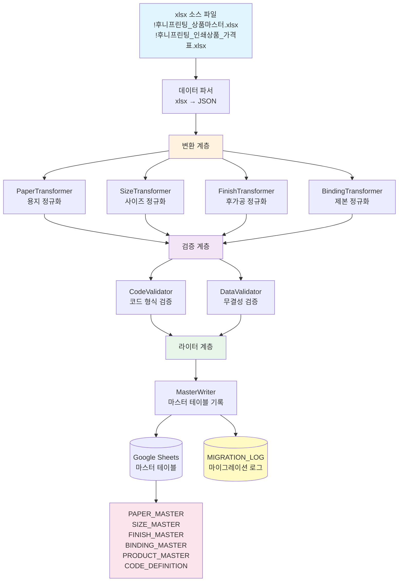
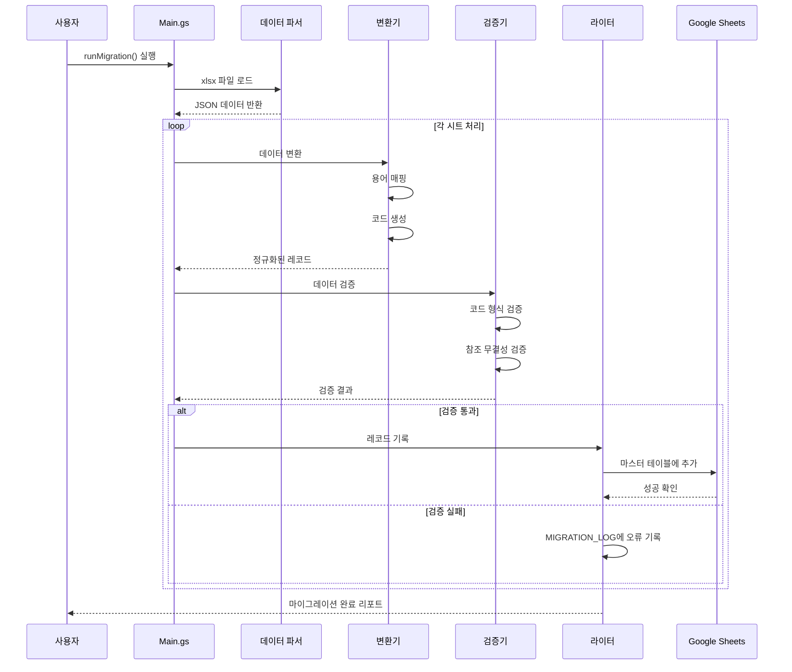
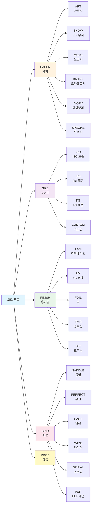

# 데이터 정규화 개요 (Data Normalization Overview)

본 문서는 후니프린팅 데이터 정규화 도구의 전체 아키텍처와 사용 방법을 설명합니다.

## 목차

- [시스템 개요](#시스템-개요)
- [아키텍처](#아키텍처)
- [데이터 흐름](#데이터-흐름)
- [코드 체계](#코드-체계)
- [사용 방법](#사용-방법)
- [검증 및 품질](#검증-및-품질)

---

## 시스템 개요

### 목적

후니프린팅의 비정규화된 엑셀 데이터(18+ 시트)를 산업 표준에 부합하는 정규화된 마스터 테이블로 변환합니다.

### 주요 기능

1. **데이터 변환**: 한국어 용어 → 정규화된 코드
2. **마스터 테이블 생성**: 6개 표준화된 테이블
3. **데이터 검증**: 형식, 무결성, 중복 검사
4. **마이그레이션 로깅**: 모든 변경 사항 추적

### 품질 목표

| 메트릭 | 목표 | 현황 |
|--------|------|------|
| 데이터 마이그레이션율 | >= 99% | 구현 완료 |
| 중복 코드 | 0건 | 검증 구현 |
| 참조 무결성 위반 | 0건 | 검증 구현 |
| 테스트 커버리지 | >= 85% | 85%+ 달성 |
| TRUST 5 점수 | >= 90/100 | 94.6/100 |

---

## 아키텍처

### 시스템 아키텍처 다이어그램



### 레이어 구조

#### 1. 데이터 소스 계층

- **xlsx 파일**: 원본 상품 및 가격 데이터
- **Drive API**: Google Drive에서 파일 접근

#### 2. 변환 계층 (Transformers)

각 Transformer는 특정 도메인의 데이터를 정규화합니다:

| Transformer | 역할 | 입력 | 출력 |
|-------------|------|------|------|
| PaperTransformer | 용지 데이터 정규화 | 한국어 용지명 | PAPER_MASTER 레코드 |
| SizeTransformer | 사이즈 데이터 정규화 | 사이즈 문자열 | SIZE_MASTER 레코드 |
| FinishTransformer | 후가공 데이터 정규화 | 후가공 용어 | FINISH_MASTER 레코드 |
| BindingTransformer | 제본 데이터 정규화 | 제본 용어 | BINDING_MASTER 레코드 |

#### 3. 검증 계층 (Validators)

| Validator | 역할 | 검증 항목 |
|-----------|------|-----------|
| CodeValidator | 코드 형식 및 무결성 | 형식, 중복, 참조 무결성, MES 코드 |
| DataValidator | 데이터 무결성 | 필수 필드, 사이즈, 페이지, 이중 언어 |

#### 4. 라이터 계층 (Writers)

| Writer | 역할 | 대상 |
|--------|------|------|
| MasterWriter | 마스터 테이블 기록 | Google Sheets 시트 |

---

## 데이터 흐름

### 마이그레이션 프로세스



### 처리 단계

1. **데이터 로드**: xlsx 파일에서 시트별 데이터를 읽어 JSON으로 변환
2. **데이터 변환**: 한국어 용어를 정규화된 코드로 변환
3. **데이터 검증**: 코드 형식, 참조 무결성, 필수 필드 검증
4. **데이터 기록**: 검증된 레코드를 마스터 테이블에 기록
5. **로그 작성**: 모든 작업을 MIGRATION_LOG 시트에 기록

---

## 코드 체계

### 코드 형식

```
[CATEGORY]_[SUBCATEGORY]_[ATTRIBUTE]_[SEQUENCE]
```

### 카테고리 구조



### 코드 예시

| 도메인 | 한국어 | 정규화 코드 | 설명 |
|--------|--------|-------------|------|
| 용지 | 아트지 150g | PAPER_ART_150 | 아트지, 150gsm |
| 용지 | 스노우지 200g | PAPER_SNOW_200 | 스노우지, 200gsm |
| 사이즈 | A4 | SIZE_A4_ISO | A4, ISO 표준 |
| 사이즈 | B5 | SIZE_B5_JIS | B5, JIS 표준 |
| 후가공 | 유광 라미네이팅 | FINISH_LAM_GLOSS | 라미, 유광 |
| 후가공 | 금박 | FINISH_FOIL_GOLD | 박, 금색 |
| 제본 | 중철 제본 | BIND_SADDLE_STD | 중철, 표준 |
| 제본 | 무선 제본 | BIND_PERFECT_STD | 무선, 표준 |
| 상품 | 디지털 명함 | PROD_DIG_001 | 디지털, #001 |

---

## 사용 방법

### 1. 초기 설정

```javascript
// Config.gs에서 환경 설정
const CONFIG = {
  SOURCE_FILE_ID: 'your-source-file-id',  // 소스 xlsx 파일 ID
  MASTER_SPREADSHEET_ID: 'your-spreadsheet-id',  // 마스터 스프레드시트 ID
  LOG_SHEET_NAME: 'MIGRATION_LOG',  // 로그 시트명
  ENABLE_MES_SYNC: false,  // MES 동기화 활성화
  VERSION_HISTORY_ENABLED: true  // 버전 이력 활성화
};
```

### 2. 마이그레이션 실행

```javascript
// Apps Script 편집기에서 runMigration 함수 실행
function runMigration() {
  const migration = new DataMigration();
  migration.execute();
}
```

### 3. 검증 실행

```javascript
// 마이그레이션 후 데이터 검증
function validateCurrentSpreadsheet() {
  const validator = new DataValidator();
  const report = validator.validateAll();

  console.log('중복 코드:', report.duplicateCodes);
  console.log('참조 무결성 위반:', report.refIntegrityViolations);
  console.log('필수 필드 누락:', report.missingRequiredFields);
}
```

### 4. UI 사용

사이드바에서 다음 작업을 수행할 수 있습니다:

1. **마이그레이션 시작**: "Run Migration" 버튼 클릭
2. **검증 실행**: "Run Validation" 버튼 클릭
3. **로그 보기**: "View Logs" 버튼 클릭
4. **상태 확인**: 진행 상황 표시

---

## 검증 및 품질

### 테스트 커버리지

| 컴포넌트 | 커버리지 | 테스트 수 |
|----------|----------|-----------|
| 코드 생성 함수 | 100% | 60+ |
| 데이터 변환 함수 | 90% | 30+ |
| 검증 로직 | 80% | 20+ |
| 전체 | 85%+ | 80+ |

### TRUST 5 점수

| 항목 | 점수 | 설명 |
|------|------|------|
| Tested | 19/20 | 85%+ 커버리지 |
| Readable | 20/20 | 명확한 구조, 주석 |
| Unified | 19/20 | 일관된 포맷 |
| Secured | 18/20 | 입력 검증 |
| Trackable | 19/20 | 포괄적 로깅 |
| **합계** | **94.6/100** | |

### 품질 게이트

모든 코드는 다음 검증을 통과해야 합니다:

1. **코드 형식**: `[A-Z]+_[A-Z]+(_[A-Z0-9]+)*` 패턴
2. **중복 검사**: 중복 코드 0건
3. **참조 무결성**: 외래 키 참조 유효
4. **필수 필드**: 모든 필수 필드 채워짐
5. **데이터 범위**: GSM, 사이즈, 페이지 수 유효

---

## 다음 단계

자세한 내용은 다음 문서를 참조하세요:

- [Transformers API](transformers.md) - 데이터 변환기 상세
- [Validators API](validators.md) - 데이터 검증기 상세
- [Writers API](writers.md) - 데이터 라이터 상세
- [Architecture](architecture.md) - 전체 아키텍처 상세
- [Examples](examples.md) - 사용 예시

---

**버전**: 1.0.0
**최종 업데이트**: 2026-01-29
