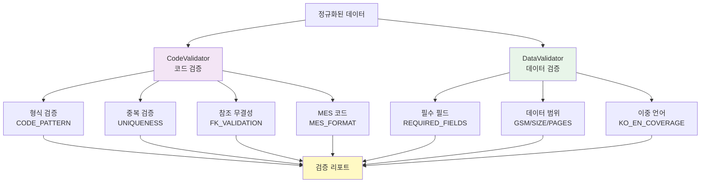

# Validators API Reference

데이터 검증기(Validator)는 정규화된 데이터의 품질을 보장하기 위한 검증 규칙을 제공합니다.

## 목차

- [개요](#개요)
- [CodeValidator](#codevalidator)
- [DataValidator](#datavalidator)
- [검증 규칙](#검증-규칙)
- [오류 처리](#오류-처리)

---

## 개요

### 검증 계층 구조



### 검증 순서

1. **코드 형식 검증**: 모든 코드가 `[A-Z]+_[A-Z]+(_[A-Z0-9]+)*` 패턴을 따르는지 확인
2. **중복 검증**: 중복된 코드가 없는지 확인
3. **참조 무결성**: 외래 키 참조가 유효한지 확인
4. **데이터 범위**: GSM, 사이즈, 페이지 수 등이 유효한지 확인
5. **필수 필드**: 모든 필수 필드가 채워졌는지 확인

---

## CodeValidator

코드 형식, 중복, 참조 무결성을 검증합니다.

### 사용 예시

```javascript
const codeValidator = new CodeValidator();

// 단일 코드 검증
const result1 = codeValidator.validateCodeFormat('PAPER_ART_150');
// 결과: {valid: true, message: 'Valid code format'}

const result2 = codeValidator.validateCodeFormat('paper_art_150');
// 결과: {valid: false, message: 'Lowercase not allowed'}

// 일괄 검증
const codes = ['PAPER_ART_150', 'SIZE_A4_ISO', 'PAPER_ART_150'];
const result3 = codeValidator.validateUniqueness(codes);
// 결과: {
//   hasDuplicates: true,
//   duplicates: ['PAPER_ART_150'],
//   duplicateCount: 1
// }

// 참조 무결성 검증
const productCodes = [
  {product_code: 'PROD_001', default_paper_code: 'PAPER_ART_150'}
];
const paperCodes = ['PAPER_ART_150', 'PAPER_SNOW_200'];
const result4 = codeValidator.validateReferenceIntegrity(productCodes, paperCodes, 'default_paper_code');
// 결과: {
//   valid: true,
//   violations: []
// }
```

### 메서드

#### `validateCodeFormat(code)`

코드 형식을 검증합니다.

```javascript
/**
 * @param {string} code - 검증할 코드
 * @returns {Object} {valid: boolean, message: string}
 */
validateCodeFormat(code)
```

**검증 규칙**:
- 패턴: `/^[A-Z]+_[A-Z]+(_[A-Z0-9]+)*$/`
- 대문자만 허용
- 언더스코어로 구분
- 최소 2개 세그먼트

**유효한 예시**:
```
PAPER_ART_150
SIZE_A4_ISO
FINISH_LAM_GLOSS
BIND_SADDLE_STD
PROD_DIG_001
```

**무효한 예시**:
```
paper_art_150      # 소문자
PAPER-ART-150      # 잘못된 구분자
PAPER_Art_150      # 혼합 케이스
PAPER__ART_150     # 이중 언더스코어
PAPER_ART          # 필수 세그먼트 누락
```

#### `validateUniqueness(codes)`

중복 코드를 검증합니다.

```javascript
/**
 * @param {Array<string>} codes - 코드 배열
 * @returns {Object} {hasDuplicates: boolean, duplicates: Array, duplicateCount: number}
 */
validateUniqueness(codes)
```

#### `validateReferenceIntegrity(records, referenceCodes, foreignKeyField)`

참조 무결성을 검증합니다.

```javascript
/**
 * @param {Array<Object>} records - 검증할 레코드 배열
 * @param {Array<string>} referenceCodes - 참조 가능한 코드 배열
 * @param {string} foreignKeyField - 외래 키 필드명
 * @returns {Object} {valid: boolean, violations: Array}
 */
validateReferenceIntegrity(records, referenceCodes, foreignKeyField)
```

**예시**:
```javascript
const products = [
  {product_code: 'PROD_001', default_paper_code: 'PAPER_ART_150'},
  {product_code: 'PROD_002', default_paper_code: 'PAPER_INVALID'}  // 무효한 참조
];
const papers = ['PAPER_ART_150', 'PAPER_SNOW_200'];

const result = codeValidator.validateReferenceIntegrity(products, papers, 'default_paper_code');
// 결과: {
//   valid: false,
//   violations: [
//     {record: 'PROD_002', field: 'default_paper_code', value: 'PAPER_INVALID'}
//   ]
// }
```

#### `validateMESCode(mesCode)`

MES 코드 형식을 검증합니다.

```javascript
/**
 * @param {string} mesCode - MES 코드
 * @returns {Object} {valid: boolean, message: string}
 */
validateMESCode(mesCode)
```

**MES 코드 형식**:
- 패턴: `/^[A-Z]{2}\d{3}[A-Z]?$/`
- 예: MP150A, MP200, SN250

---

## DataValidator

데이터 무결성을 검증합니다.

### 사용 예시

```javascript
const dataValidator = new DataValidator();

// 필수 필드 검증
const record1 = {
  paper_code: 'PAPER_ART_150',
  paper_name_ko: '아트지 150g',
  gsm: 150
};
const result1 = dataValidator.validateRequiredFields(record1, 'PAPER_MASTER');
// 결과: {valid: true, missing: []}

// GSM 검증
const result2 = dataValidator.validateGSM(150);
// 결과: {valid: true, message: 'Valid GSM'}

const result3 = dataValidator.validateGSM(600);
// 결과: {valid: false, message: 'GSM out of range (50-500)'}

// 사이즈 검증
const result4 = dataValidator.validateSizeDimensions(210, 297, 'ISO');
// 결과: {valid: true, message: 'Valid ISO size'}

// 페이지 수 검증
const result5 = dataValidator.validatePageCount(32, 'SADDLE');
// 결과: {valid: true, message: 'Valid page count for SADDLE binding'}
```

### 메서드

#### `validateRequiredFields(record, masterType)`

필수 필드를 검증합니다.

```javascript
/**
 * @param {Object} record - 레코드 객체
 * @param {string} masterType - 마스터 테이블 유형
 * @returns {Object} {valid: boolean, missing: Array<string>}
 */
validateRequiredFields(record, masterType)
```

**필수 필드 정의**:

| 마스터 테이블 | 필수 필드 |
|--------------|-----------|
| PAPER_MASTER | paper_code, paper_name_ko, paper_type, gsm, status |
| SIZE_MASTER | size_code, size_name, width_mm, height_mm, standard, status |
| FINISH_MASTER | finish_code, finish_name_ko, category, status |
| BINDING_MASTER | binding_code, binding_name_ko, binding_type, min_pages, max_pages, page_unit, status |
| PRODUCT_MASTER | product_code, product_name_ko, category, min_quantity, quantity_unit, status |

#### `validateGSM(gsm)`

GSM 평량을 검증합니다.

```javascript
/**
 * @param {number} gsm - GSM 값
 * @returns {Object} {valid: boolean, message: string}
 */
validateGSM(gsm)
```

**검증 규칙**:
- 범위: 50-500 g/m²
- 일반적인 값: 80, 100, 120, 150, 180, 200, 250, 300, 350, 400
- 허용 오차: ±5%

#### `validateSizeDimensions(width, height, standard)`

사이즈 차원을 검증합니다.

```javascript
/**
 * @param {number} width - 너비 (mm)
 * @param {number} height - 높이 (mm)
 * @param {string} standard - 표준 (ISO, JIS, KS, CUSTOM)
 * @returns {Object} {valid: boolean, message: string}
 */
validateSizeDimensions(width, height, standard)
```

**유효 범위**:

| 표준 | 너비 범위 (mm) | 높이 범위 (mm) |
|------|---------------|----------------|
| ISO A | 26-841 | 37-1189 |
| JIS B | 32-1030 | 45-1456 |
| KS | 100-1000 | 100-1500 |
| CUSTOM | 10-2000 | 10-3000 |

#### `validatePageCount(pages, bindingType)`

페이지 수를 제본 유형별로 검증합니다.

```javascript
/**
 * @param {number} pages - 페이지 수
 * @param {string} bindingType - 제본 유형
 * @returns {Object} {valid: boolean, message: string}
 */
validatePageCount(pages, bindingType)
```

**페이지 제약**:

| 제본 유형 | 최소 페이지 | 최대 페이지 | 페이지 단위 |
|-----------|-------------|-------------|-------------|
| SADDLE | 8 | 64 | 4 |
| PERFECT | 48 | 500 | 8 |
| CASE | 100 | 1000 | 16 |
| WIRE | 10 | 200 | 2 |
| SPIRAL | 10 | 300 | 2 |
| PUR | 100 | 800 | 8 |

#### `validateBilingualCoverage(records, codeField, nameKoField, nameEnField)`

이중 언어 커버리지를 검증합니다.

```javascript
/**
 * @param {Array<Object>} records - 레코드 배열
 * @param {string} codeField - 코드 필드명
 * @param {string} nameKoField - 한국어 이름 필드명
 * @param {string} nameEnField - 영어 이름 필드명
 * @returns {Object} {coverage: number, missing: Array}
 */
validateBilingualCoverage(records, codeField, nameKoField, nameEnField)
```

**목표**: 80% 이상의 레코드가 영어명을 가짐

---

## 검증 규칙

### 코드 형식 규칙

```javascript
const CODE_PATTERN = /^[A-Z]+_[A-Z]+(_[A-Z0-9]+)*$/;
```

### GSM 규칙

```javascript
const GSM_RANGE = {min: 50, max: 500};
const GSM_COMMON = [80, 100, 120, 150, 180, 200, 250, 300, 350, 400];
const GSM_TOLERANCE = 0.05; // ±5%
```

### 사이즈 규칙

```javascript
const SIZE_RANGES = {
  ISO: {width: {min: 26, max: 841}, height: {min: 37, max: 1189}},
  JIS: {width: {min: 32, max: 1030}, height: {min: 45, max: 1456}},
  KS: {width: {min: 100, max: 1000}, height: {min: 100, max: 1500}},
  CUSTOM: {width: {min: 10, max: 2000}, height: {min: 10, max: 3000}}
};
```

### 페이지 제약 규칙

```javascript
const PAGE_CONSTRAINTS = {
  SADDLE: {min: 8, max: 64, unit: 4},
  PERFECT: {min: 48, max: 500, unit: 8},
  CASE: {min: 100, max: 1000, unit: 16},
  WIRE: {min: 10, max: 200, unit: 2},
  SPIRAL: {min: 10, max: 300, unit: 2},
  PUR: {min: 100, max: 800, unit: 8}
};
```

---

## 오류 처리

### 검증 결과 객체

모든 검증 메서드는 다음 형식의 결과 객체를 반환합니다:

```javascript
{
  valid: boolean,      // 검증 통과 여부
  message: string,     // 결과 메시지
  errors: Array,       // 오류 배열 (선택)
  warnings: Array,     // 경고 배열 (선택)
  details: Object      // 상세 정보 (선택)
}
```

### 오류 코드

| 코드 | 설명 | 해결 방법 |
|------|------|-----------|
| INVALID_CODE_FORMAT | 코드 형식 위반 | 대문자, 언더스코어 사용 |
| DUPLICATE_CODE | 중복 코드 | 고유한 코드 사용 |
| REFERENCE_VIOLATION | 참조 무결성 위반 | 외래 키 참조 확인 |
| MISSING_REQUIRED | 필수 필드 누락 | 모든 필수 필드 채우기 |
| GSM_OUT_OF_RANGE | GSM 범위 초과 | 50-500 범위 내 값 사용 |
| INVALID_SIZE | 사이즈 유효하지 않음 | 표준 사이즈 사용 |
| INVALID_PAGE_COUNT | 페이지 수 위반 | 제본 유형별 제약 확인 |

### 검증 리포트 생성

```javascript
function generateValidationReport(records) {
  const codeValidator = new CodeValidator();
  const dataValidator = new DataValidator();

  const report = {
    timestamp: new Date().toISOString(),
    total_records: records.length,
    code_format: {passed: 0, failed: 0, errors: []},
    uniqueness: {passed: true, duplicates: []},
    reference_integrity: {passed: true, violations: []},
    data_integrity: {passed: 0, failed: 0, errors: []}
  };

  // 코드 형식 검증
  records.forEach(record => {
    const result = codeValidator.validateCodeFormat(record.code);
    if (result.valid) {
      report.code_format.passed++;
    } else {
      report.code_format.failed++;
      report.code_format.errors.push({code: record.code, error: result.message});
    }
  });

  // 중복 검증
  const codes = records.map(r => r.code);
  const uniquenessResult = codeValidator.validateUniqueness(codes);
  report.uniqueness.passed = !uniquenessResult.hasDuplicates;
  report.uniqueness.duplicates = uniquenessResult.duplicates;

  // 참조 무결성 검증 (PRODUCT_MASTER의 경우)
  if (records[0].default_paper_code) {
    const refResult = codeValidator.validateReferenceIntegrity(
      records,
      getAllPaperCodes(),
      'default_paper_code'
    );
    report.reference_integrity.passed = refResult.valid;
    report.reference_integrity.violations = refResult.violations;
  }

  return report;
}
```

---

## 통합 검증 예시

```javascript
// 전체 스프레드시트 검증
function validateCurrentSpreadsheet() {
  const sheets = SpreadsheetApp.getActiveSpreadsheet();
  const codeValidator = new CodeValidator();
  const dataValidator = new DataValidator();

  const report = {
    PAPER_MASTER: validateSheet(sheets.getSheetByName('PAPER_MASTER'), codeValidator, dataValidator),
    SIZE_MASTER: validateSheet(sheets.getSheetByName('SIZE_MASTER'), codeValidator, dataValidator),
    FINISH_MASTER: validateSheet(sheets.getSheetByName('FINISH_MASTER'), codeValidator, dataValidator),
    BINDING_MASTER: validateSheet(sheets.getSheetByName('BINDING_MASTER'), codeValidator, dataValidator),
    PRODUCT_MASTER: validateSheet(sheets.getSheetByName('PRODUCT_MASTER'), codeValidator, dataValidator)
  };

  return report;
}

function validateSheet(sheet, codeValidator, dataValidator) {
  const data = sheet.getDataRange().getValues();
  const headers = data[0];
  const records = data.slice(1).map(row => {
    const record = {};
    headers.forEach((header, i) => {
      record[header] = row[i];
    });
    return record;
  });

  // 코드 형식 검증
  const codeField = headers[0]; // 첫 번째 필드가 코드라고 가정
  const formatErrors = records
    .map(r => codeValidator.validateCodeFormat(r[codeField]))
    .filter(r => !r.valid);

  // 중복 검증
  const codes = records.map(r => r[codeField]);
  const duplicates = codeValidator.validateUniqueness(codes).duplicates;

  return {
    total: records.length,
    format_errors: formatErrors.length,
    duplicates: duplicates.length,
    valid: formatErrors.length === 0 && duplicates.length === 0
  };
}
```

---

**버전**: 1.0.0
**최종 업데이트**: 2026-01-29
