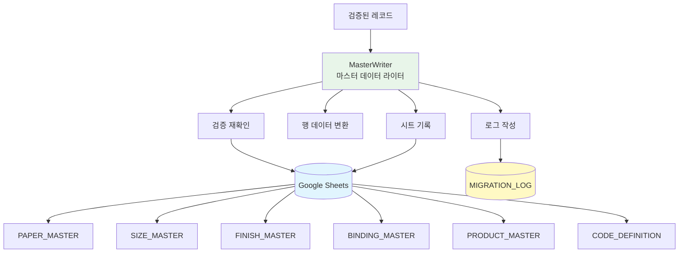
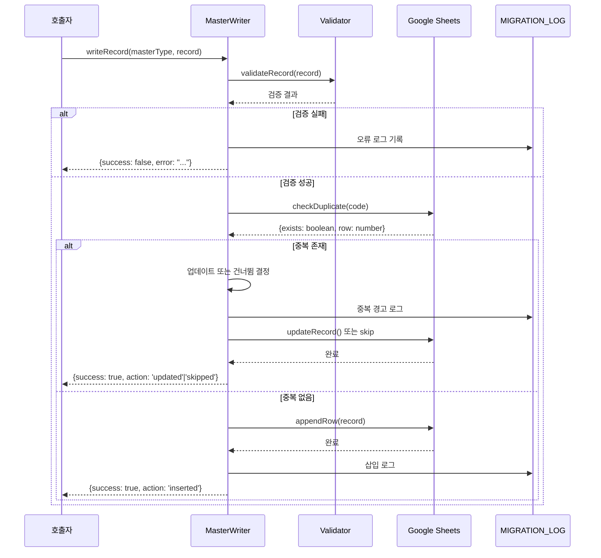

# Writers API Reference

데이터 라이터(Writer)는 검증된 데이터를 Google Sheets 마스터 테이블에 기록합니다.

## 목차

- [개요](#개요)
- [MasterWriter](#masterwriter)
- [데이터 기록 흐름](#데이터-기록-흐름)
- [로깅 시스템](#로깅-시스템)

---

## 개요

### 라이터 계층 구조



### 기능

1. **데이터 기록**: 검증된 레코드를 해당 마스터 테이블에 기록
2. **중복 처리**: 중복 레코드 감지 및 병합/거부
3. **로그 작성**: 모든 작업을 MIGRATION_LOG 시트에 기록
4. **진행 추적**: 진행률 및 상태 추적

---

## MasterWriter

검증된 데이터를 마스터 테이블에 기록합니다.

### 사용 예시

```javascript
const masterWriter = new MasterWriter(spreadsheet);

// 단일 레코드 기록
const record = {
  paper_code: 'PAPER_ART_150',
  paper_name_ko: '아트지 150g',
  paper_name_en: 'Art Paper 150gsm',
  paper_type: 'ART',
  gsm: 150,
  thickness_um: 120,
  finish: 'GLOSS',
  color: 'WHITE',
  status: 'A',
  created_at: '2026-01-29T10:00:00',
  updated_at: '2026-01-29T10:00:00'
};

masterWriter.writeRecord('PAPER_MASTER', record);
// 결과: PAPER_MASTER 시트에 레코드 추가, MIGRATION_LOG에 기록

// 일괄 기록
const records = [
  {paper_code: 'PAPER_ART_150', paper_name_ko: '아트지 150g', ...},
  {paper_code: 'PAPER_SNOW_200', paper_name_ko: '스노우지 200g', ...}
];

masterWriter.writeBatch('PAPER_MASTER', records);
// 결과: PAPER_MASTER 시트에 모든 레코드 추가, MIGRATION_LOG에 기록

// 중복 처리
const duplicateRecord = {
  paper_code: 'PAPER_ART_150',  // 이미 존재하는 코드
  paper_name_ko: '아트지 150g (수정)',
  ...
};

masterWriter.writeRecord('PAPER_MASTER', duplicateRecord);
// 결과: 중복 경고 로그 기록, 레코드 업데이트 또는 거부
```

### 메서드

#### `writeRecord(masterType, record)`

단일 레코드를 기록합니다.

```javascript
/**
 * @param {string} masterType - 마스터 테이블 유형 (PAPER_MASTER, SIZE_MASTER, etc.)
 * @param {Object} record - 기록할 레코드 객체
 * @returns {Object} {success: boolean, message: string, action: 'inserted'|'updated'|'skipped'}
 */
writeRecord(masterType, record)
```

**동작**:
1. 레코드 검증 재확인
2. 중복 코드 확인
3. 중복 없으면 삽입
4. 중복 있으면 업데이트 또는 건너뜀
5. 로그 작성

**반환 값**:
```javascript
{
  success: true,
  message: 'Record inserted successfully',
  action: 'inserted',  // 'inserted', 'updated', 'skipped'
  row: 2,              // 삽입된 행 번호
  timestamp: '2026-01-29T10:00:00'
}
```

#### `writeBatch(masterType, records)`

복수 레코드를 일괄 기록합니다.

```javascript
/**
 * @param {string} masterType - 마스터 테이블 유형
 * @param {Array<Object>} records - 기록할 레코드 배열
 * @returns {Object} {inserted: number, updated: number, skipped: number, errors: Array}
 */
writeBatch(masterType, records)
```

**동작**:
1. 각 레코드를 순차 처리
2. 검증 및 중복 확인
3. 일괄 삽입 (성능 최적화)
4. 로그 요약 작성

**반환 값**:
```javascript
{
  inserted: 45,
  updated: 5,
  skipped: 2,
  errors: [
    {index: 10, error: 'Invalid GSM value', code: 'PAPER_ART_999'}
  ],
  total: 52,
  duration: 2500  // 밀리초
}
```

#### `checkDuplicate(masterType, code)`

중복 코드를 확인합니다.

```javascript
/**
 * @param {string} masterType - 마스터 테이블 유형
 * @param {string} code - 확인할 코드
 * @returns {Object} {exists: boolean, row: number|null}
 */
checkDuplicate(masterType, code)
```

**예시**:
```javascript
const result = masterWriter.checkDuplicate('PAPER_MASTER', 'PAPER_ART_150');
// 결과: {exists: true, row: 5}

const result2 = masterWriter.checkDuplicate('PAPER_MASTER', 'PAPER_NEW_001');
// 결과: {exists: false, row: null}
```

#### `updateRecord(masterType, code, updates)`

기존 레코드를 업데이트합니다.

```javascript
/**
 * @param {string} masterType - 마스터 테이블 유형
 * @param {string} code - 업데이트할 레코드 코드
 * @param {Object} updates - 업데이트할 필드
 * @returns {Object} {success: boolean, message: string}
 */
updateRecord(masterType, code, updates)
```

**예시**:
```javascript
const result = masterWriter.updateRecord('PAPER_MASTER', 'PAPER_ART_150', {
  thickness_um: 125,
  updated_at: '2026-01-29T11:00:00'
});
// 결과: {success: true, message: 'Record updated successfully'}
```

---

## 데이터 기록 흐름

### 기록 프로세스 다이어그램



### 처리 단계 상세

#### 1단계: 사전 검증

```javascript
// 레코드 검증
const validationResult = this.validator.validateRecord(record, masterType);
if (!validationResult.valid) {
  this.logError(masterType, record, validationResult.errors);
  return {success: false, errors: validationResult.errors};
}
```

#### 2단계: 중복 확인

```javascript
// 중복 코드 확인
const duplicateCheck = this.checkDuplicate(masterType, record.code);
if (duplicateCheck.exists) {
  return this.handleDuplicate(masterType, record, duplicateCheck.row);
}
```

#### 3단계: 데이터 변환

```javascript
// 행 데이터 변환
const rowData = this.recordToRow(record, masterType);
// 예: {paper_code: 'PAPER_ART_150', ...} → ['PAPER_ART_150', '아트지 150g', ...]
```

#### 4단계: 시트 기록

```javascript
// 시트에 행 추가
const sheet = this.spreadsheet.getSheetByName(masterType);
sheet.appendRow(rowData);
```

#### 5단계: 로그 작성

```javascript
// 로그 작성
this.logAction(masterType, record, 'inserted', {
  row: sheet.getLastRow(),
  timestamp: new Date().toISOString()
});
```

---

## 로깅 시스템

### MIGRATION_LOG 시트 구조

| timestamp | master_type | action | code | message | details |
|-----------|-------------|--------|------|---------|---------|
| 2026-01-29T10:00:00 | PAPER_MASTER | inserted | PAPER_ART_150 | Record inserted | row: 2 |
| 2026-01-29T10:00:01 | PAPER_MASTER | duplicate | PAPER_ART_150 | Duplicate code found | existing_row: 2 |
| 2026-01-29T10:00:02 | SIZE_MASTER | error | SIZE_INVALID | Invalid size | width: 9999 |

### 로그 수준

```javascript
const LOG_LEVELS = {
  INFO: 'INFO',       // 일반 작업 (삽입, 업데이트)
  WARNING: 'WARNING', // 경고 (중복, 제외)
  ERROR: 'ERROR'      // 오류 (검증 실패, 시스템 오류)
};
```

### 로그 메서드

#### `logAction(masterType, record, action, details)`

작업 로그를 기록합니다.

```javascript
/**
 * @param {string} masterType - 마스터 테이블 유형
 * @param {Object} record - 레코드 객체
 * @param {string} action - 작업 유형 (inserted, updated, skipped, error)
 * @param {Object} details - 상세 정보
 */
logAction(masterType, record, action, details)
```

#### `logError(masterType, record, errors)`

오류 로그를 기록합니다.

```javascript
/**
 * @param {string} masterType - 마스터 테이블 유형
 * @param {Object} record - 레코드 객체
 * @param {Array<string>} errors - 오류 배열
 */
logError(masterType, record, errors)
```

#### `logWarning(masterType, code, message)`

경고 로그를 기록합니다.

```javascript
/**
 * @param {string} masterType - 마스터 테이블 유형
 * @param {string} code - 코드
 * @param {string} message - 경고 메시지
 */
logWarning(masterType, code, message)
```

### 로그 예시

```javascript
// 삽입 로그
masterWriter.logAction('PAPER_MASTER', record, 'inserted', {
  row: 5,
  code: 'PAPER_ART_150',
  message: 'New record inserted successfully'
});
// MIGRATION_LOG: "2026-01-29T10:00:00 | PAPER_MASTER | inserted | PAPER_ART_150 | New record inserted successfully | row: 5"

// 중복 경고
masterWriter.logWarning('PAPER_MASTER', 'PAPER_ART_150', 'Duplicate code found at row 5');
// MIGRATION_LOG: "2026-01-29T10:00:01 | PAPER_MASTER | WARNING | PAPER_ART_150 | Duplicate code found at row 5 | "

// 오류 로그
masterWriter.logError('PAPER_MASTER', record, ['Invalid GSM: 999', 'Missing required field: paper_type']);
// MIGRATION_LOG: "2026-01-29T10:00:02 | PAPER_MASTER | ERROR | PAPER_ART_150 | Validation failed | errors: Invalid GSM: 999, Missing required field: paper_type"
```

### 로그 쿼리

```javascript
// 특정 마스터 테이블의 로그 조회
function getLogsByMasterType(masterType) {
  const logSheet = SpreadsheetApp.getActiveSpreadsheet().getSheetByName('MIGRATION_LOG');
  const data = logSheet.getDataRange().getValues();
  const headers = data[0];

  const masterTypeIndex = headers.indexOf('master_type');
  const filteredLogs = data.filter(row => row[masterTypeIndex] === masterType);

  return filteredLogs.map(row => {
    const log = {};
    headers.forEach((header, i) => {
      log[header] = row[i];
    });
    return log;
  });
}

// 오류 로그만 조회
function getErrorLogs() {
  const logSheet = SpreadsheetApp.getActiveSpreadsheet().getSheetByName('MIGRATION_LOG');
  const data = logSheet.getDataRange().getValues();

  const messageIndex = data[0].indexOf('message');
  return data.slice(1).filter(row => row[messageIndex].includes('ERROR'));
}
```

---

## 성능 최적화

### 일괄 처리

```javascript
// 개별 기록보다 일괄 처리 권장
const records = [...]; // 100개 레코드

// 비권장: 개별 기록
records.forEach(record => {
  masterWriter.writeRecord('PAPER_MASTER', record);  // 100번의 API 호출
});

// 권장: 일괄 기록
masterWriter.writeBatch('PAPER_MASTER', records);  // 1번의 API 호출 + 내부 일괄 처리
```

### 진행률 추적

```javascript
// 대용량 일괄 처리 시 진행률 추적
function writeBatchWithProgress(masterType, records) {
  const total = records.length;
  const batchSize = 100;
  const progress = {current: 0, total: total, percentage: 0};

  for (let i = 0; i < records.length; i += batchSize) {
    const batch = records.slice(i, i + batchSize);
    masterWriter.writeBatch(masterType, batch);

    progress.current = i + batch.length;
    progress.percentage = Math.round((progress.current / total) * 100);

    Logger.log(`Progress: ${progress.percentage}% (${progress.current}/${total})`);
  }

  return progress;
}
```

### 메모리 관리

```javascript
// 대용량 데이터 처리 시 청크 분할
function writeLargeDataset(masterType, records, chunkSize = 500) {
  const chunks = [];
  for (let i = 0; i < records.length; i += chunkSize) {
    chunks.push(records.slice(i, i + chunkSize));
  }

  const results = chunks.map((chunk, index) => {
    Logger.log(`Processing chunk ${index + 1}/${chunks.length}`);
    return masterWriter.writeBatch(masterType, chunk);
  });

  return results;
}
```

---

## 오류 처리

### 일반적인 오류 상황

| 오류 | 원인 | 해결 방법 |
|------|------|-----------|
| 시트 없음 | 마스터 테이블 시트가 존재하지 않음 | 시트 생성 |
| 중복 코드 | 동일한 코드가 이미 존재 | 업데이트 또는 건너뜀 |
| 검증 실패 | 레코드 데이터가 검증 규칙 위반 | 데이터 수정 후 재시도 |
| API 제한 | Google Apps Script API 호출 제한 | 일괄 처리 및 지연 |

### 오류 복구

```javascript
// 오류 발생 시 복구
function safeWriteRecord(masterType, record, maxRetries = 3) {
  let retries = 0;

  while (retries < maxRetries) {
    try {
      const result = masterWriter.writeRecord(masterType, record);
      return result;
    } catch (error) {
      retries++;
      Logger.log(`Retry ${retries}/${maxRetries}: ${error.message}`);

      if (retries >= maxRetries) {
        masterWriter.logError(masterType, record, [error.message]);
        return {success: false, error: error.message};
      }

      Utilities.sleep(1000 * retries); // 지연 후 재시도
    }
  }
}
```

---

**버전**: 1.0.0
**최종 업데이트**: 2026-01-29
